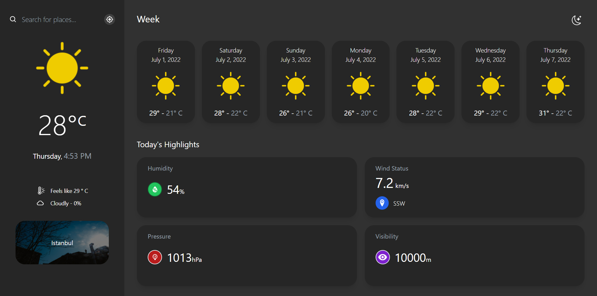
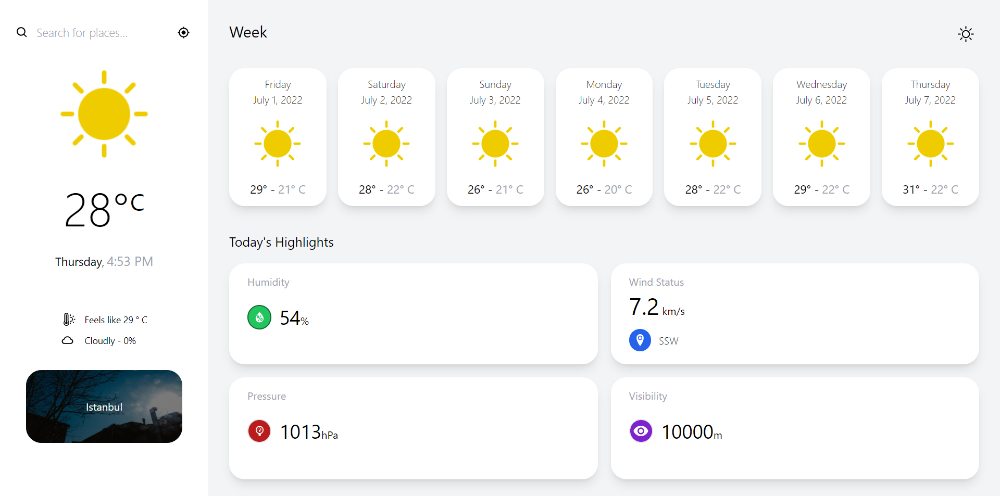

# :thermometer: Weather App with React

* Patika.dev Redux module "Weather App" project.

## :key: Get API key
[https://openweathermap.org/](https://openweathermap.org/)
* Accesses Open Weather API for weather data.
* REACT_APP_API_KEY=your-api

## :computer: Setup 
1. Clone the repository and install its features.
```
npm install or yarn install
```

2. Create .env and add the follow key.
```
add project .env file and the follow key (REACT_APP_API_KEY=your-api)
```

3. Use the project locally (localhost).
```
npm start or yarn start
```

## Project Features
:heavy_check_mark: Dark and light theme
:heavy_check_mark: City finder
:heavy_check_mark: Today and daily weather information
:heavy_check_mark: State management with Redux
:heavy_check_mark: Get weather information of your location

## :fire: Technologies and Libraries
:point_right: React.js
:point_right: Redux
:point_right: Redux Toolkit
:point_right: Axios
:point_right: Tailwind CSS
:point_right: Moment.js
:point_right: React-Icons

## Screenshot

